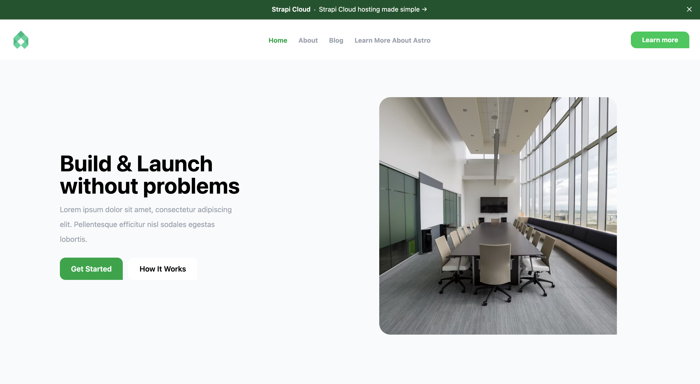
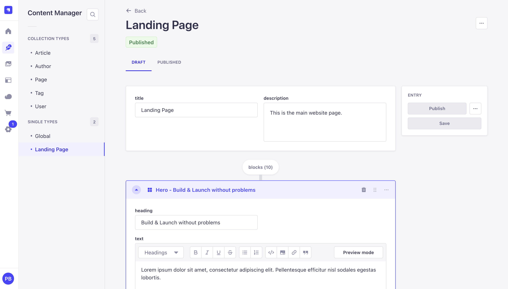
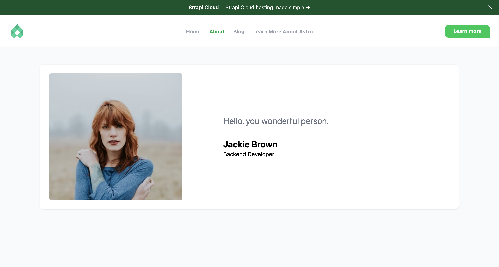
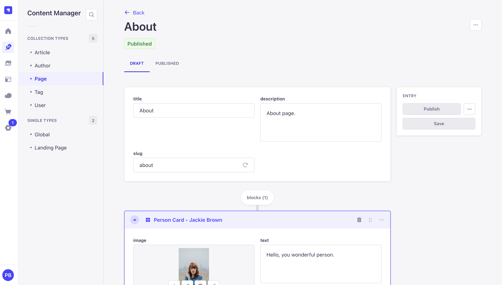
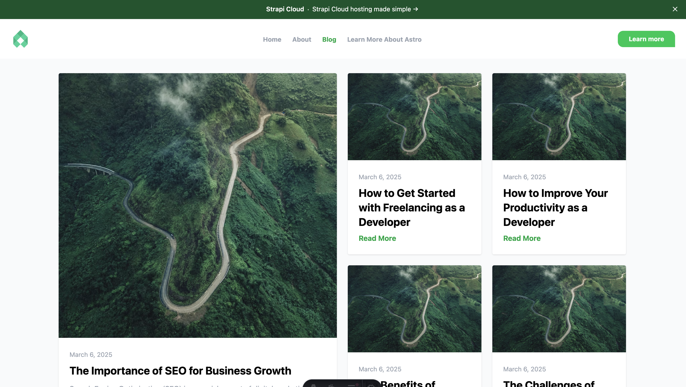
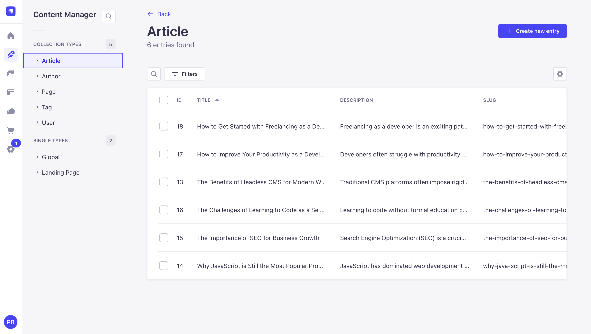
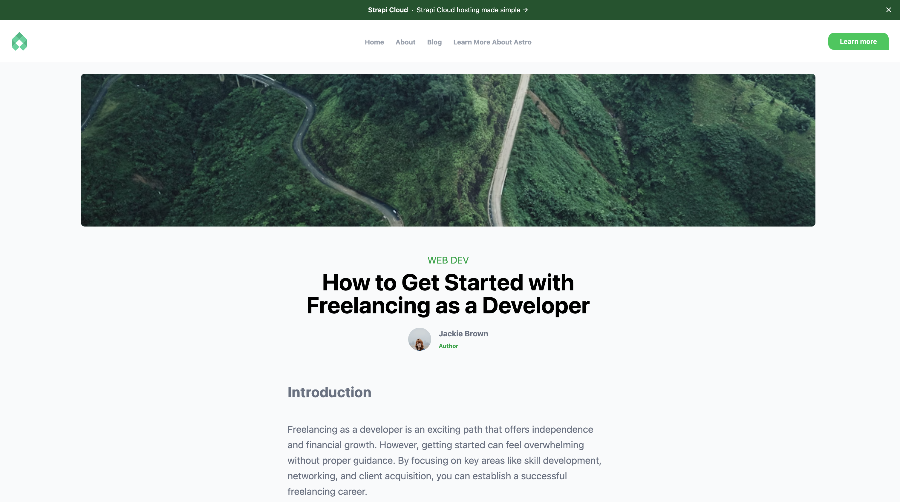
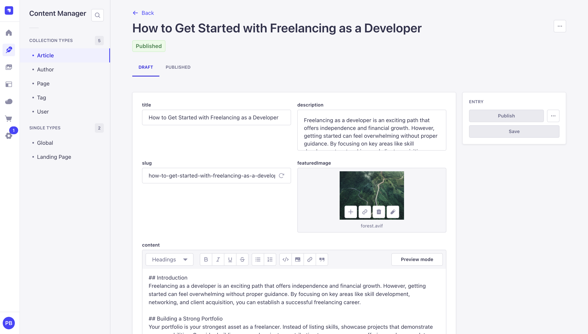
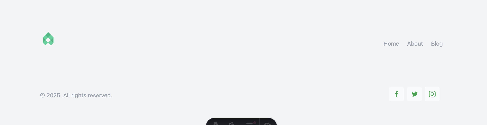
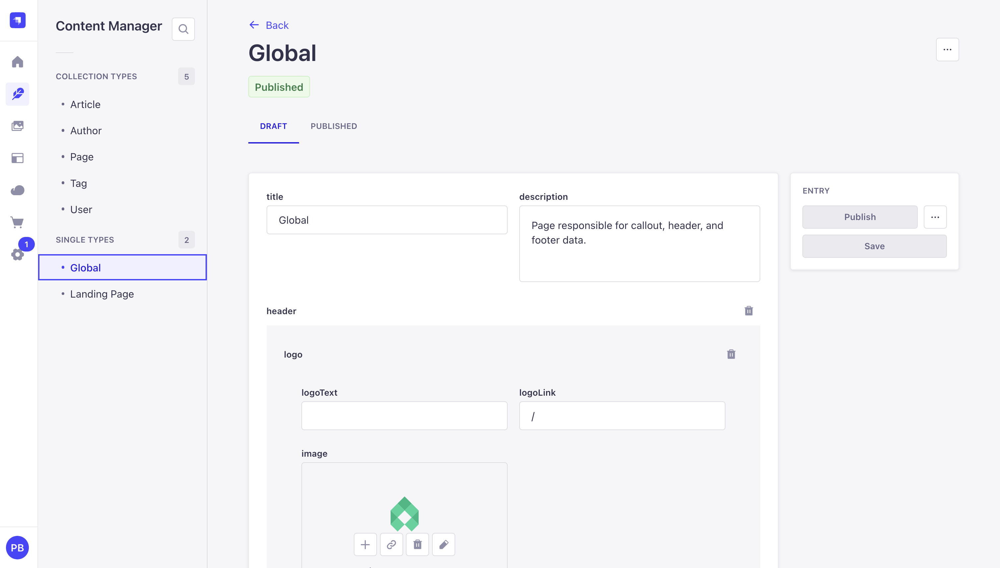

# Astro 5 and Strapi 5 Example Project

This is an example project for Astro 5 and Strapi 5. It is a simple project that uses Astro 5 and Strapi 5 to create a website with a landing page, a blog, and a contact form.

Uses the new strapi-community-astro-loader-v2 to fetch data from Strapi for pages and articles.

(contact form not implemented yet)


## Getting Started

1. Clone the repository

In the root directory, run:

```bash
git clone https://github.com/PaulBratslavsky/astro-strapi-example-project.git
```

2. Install the dependencies

In the root directory, run:

```bash
yarn setup
```

To seed the database, run:

```bash
yarn seed
```


And do start both the Astro client and the Strapi server:

```bash
yarn dev
```

## Project Structure

The project is structured as follows:

- `client`: The Astro client
- `server`: The Strapi server

The `client` directory contains the Astro client and the `server` directory contains the Strapi server.


## Astro Pages Overview

### Home Page

The home page is the main page of the website. It is the first page that loads when the user navigates to the website.



The content is structured in blocks. Each block is a component that is responsible for rendering a specific section of the page and all the data is fetched from Strapi from our landing page content type.




### Dynamic Page 
The dynamic page is a page that is rendered from a Strapi and consist of blocks similar to the home page. 



This allow a none-technical user to create a new page by just adding and rearranging the blocks.

In this example we are just rendering the person block.



### Blog Page

The blog page pulls all the posts from the blog content type and displays them in a paginated list which is handled by Astro.



The blog page is rendered from the blog page content type.



### Article Page

The article page is a page that is rendered from a Strapi and consist of blocks similar to the home page plus additional fields like featured image, tags, and author.



The article page is rendered from the article content type.




### Global Page

The global page is responsible for the header and footer content of the website.




The global page is rendered from the global content type.



## Thank you

Thank you for checking out this example project. I hope you find it useful.

If you have any questions or suggestions, please feel free to post an issue on the [GitHub repository](https://github.com/PaulBratslavsky/astro-strapi-example-project).

All the best,

Paul 

Socials:

[YouTube](https://www.youtube.com/@CodingAfterThirty)
[X](https://x.com/codingthirty)
# headless-astro-strapi
